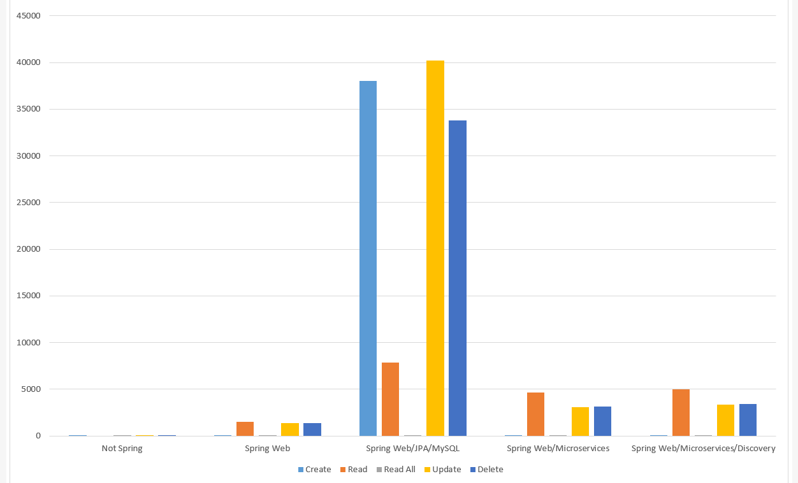
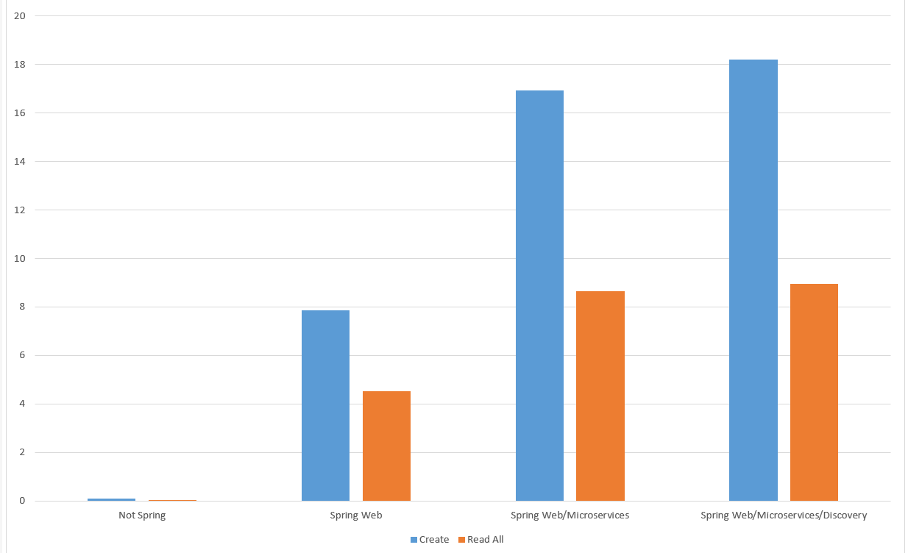

# Spring Speed Test

This project is a speed test of Java Spring, in preparation for application development.
This project is a speed test of Java Spring, in preparation for application development. A simple Java Model object is created, consisting of two int fields and a String field. Five tests are then performed on 10,000 of these model objects.

<UL>
  <LI>Adding objects to a HashMap without using Java Spring</LI>
  <LI>Adding objects to a HashMap via Spring-web.</LI>
  <LI>Adding objects to a MySQL database, via Spring-web and JPA.</LI>
  <LI>Adding objects to a HashMap via two Spring-web microservices.</LI>
  <LI>Adding objects to a HashMap via two Spring-web microservices and a Eureka discovery server.</LI>
</UL>

The tests are broken into 5 difference stages:

<UL>
  <LI>Create [batch] 10,000 Records are added. In the spring tests this is done as a batch of 10,000, rather than 10,000 calls to the webservices.</LI>
  <LI>Read 10,000 records, one at a time.</LI>
  <LI>Read 10,000 records as a batch.</LI>
  <LI>Update 10,000 records, one at a time.</LI>
  <LI>Delete 10,000 records, one at a time.</LI>
</UL>

The test cycle is repeated 100 times and the results show the average of 100 results. The first chart shows the initial results. Values on the y-axis are in milliseconds per thousand updates.

</img>

This leads me to conclude that JPA and MySQL is too much of a performance hit to perform dynamic processing of state as an application is running. Also, it is clear that batch running is far more efficient than performing many calls to the web services. The second chart has the JPA/MySQL result removed and only shows the batch tasks - create and read all.

</img>

It appears that there is similar performance hit when using web services for each REST call. In other words, using two microservices takes twice as long as using one. This means that the services should keep inter-service communication to a minimum if fast processing is paramount.

The conclusions so far are:

<UL>
  <LI>JPA and MySQL is suitable for saving state between application runs but will slow the application significantly if used in processing.</LI>
  <LI>Inter-service communication should be carefully considered if performance is important.</LI>
  <LI>Discovery server has some minor performance hit, but will enable load balancing.</LI>
</UL>
